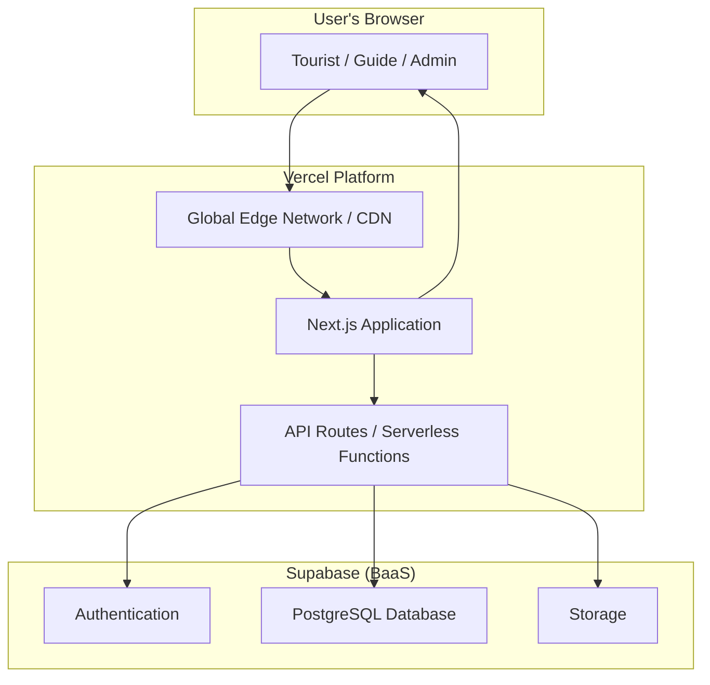
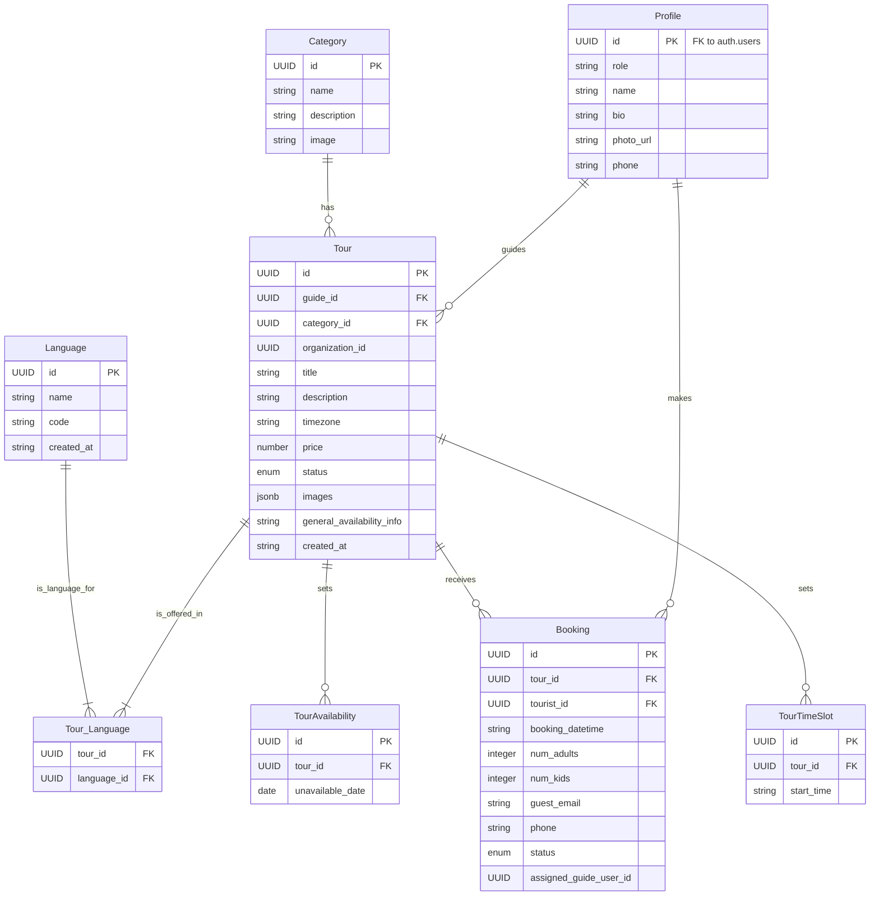
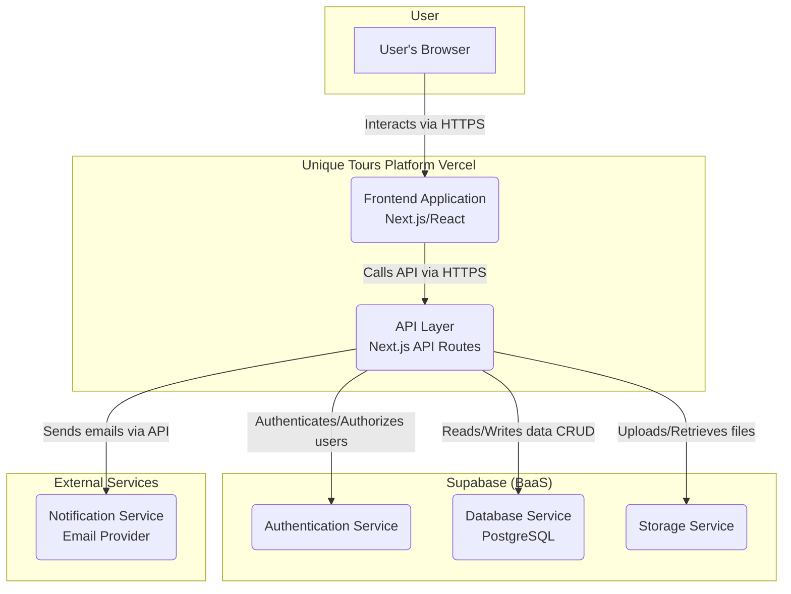
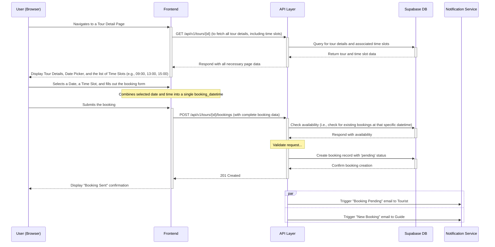
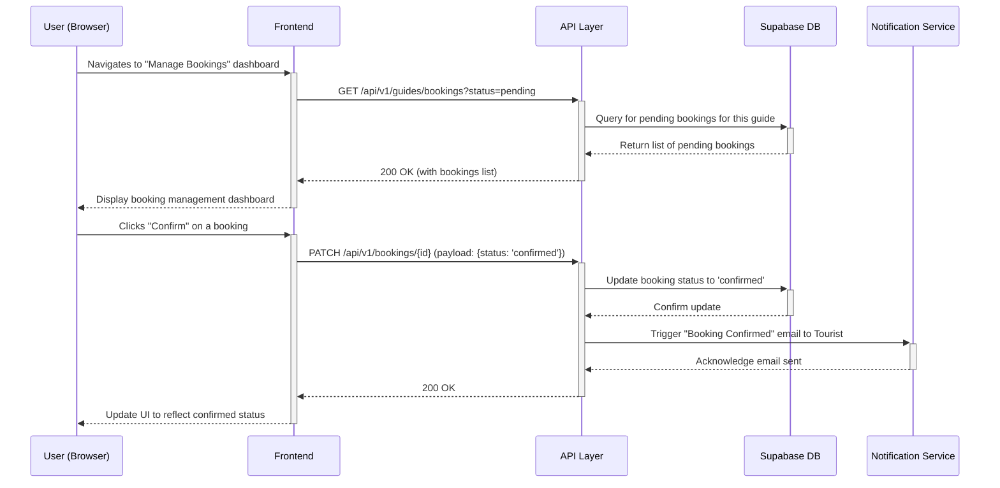
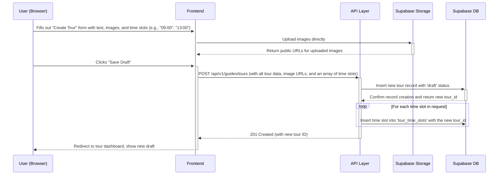

# Unique Tours Platform Fullstack Architecture Document

*Version: 1.0*
*Date: 2025-06-25*

## Introduction

This document outlines the complete fullstack architecture for the Unique Tours Platform, including backend systems, frontend implementation, and their integration. It serves as the single source of truth for AI-driven development, ensuring consistency across the entire technology stack. This unified approach combines what would traditionally be separate backend and frontend architecture documents, streamlining the development process for modern fullstack applications where these concerns are increasingly intertwined.

### Starter Template or Existing Project

N/A - This is a greenfield project. The architecture will be designed from scratch based on the selected technology stack.

### Change Log

| Date | Version | Description | Author |
| :--- | :------ | :---------- | :----- |
| 2025-06-25 | 1.0 | Initial draft of the fullstack architecture document. | Winston (Architect) |

-----

## High Level Architecture

### Technical Summary

This architecture outlines a fullstack solution for the Unique Tours Platform, centered around a monolithic Next.js application deployed on Vercel. The frontend will be built with React and Next.js, while the backend logic will be handled by a combination of Next.js API routes (acting as serverless functions) and Supabase's Backend-as-a-Service (BaaS) capabilities. Supabase will provide the core PostgreSQL database, user authentication, and file storage. This serverless, integrated approach is designed to meet the project's goals for rapid development, low operational overhead, cost-effectiveness, and future scalability.

### Platform and Infrastructure Choice

Based on the requirements in the PRD, the chosen platform is a combination of Vercel for hosting and Supabase for the backend services.

**Platform:** Vercel + Supabase
**Key Services:**

  * **Vercel:** Hosting, Serverless Functions (for API routes), CI/CD, Global Edge Network.
  * **Supabase:** PostgreSQL Database, Authentication, and File Storage.
    **Deployment Host and Regions:**
  * **Vercel:** Global Edge Network (no specific region selection required).
  * **Supabase:** Recommend **Asia Pacific (Singapore)** for lowest latency to users in Vietnam.

This combination is highly recommended as it is purpose-built for the Next.js framework, providing exceptional performance, seamless deployment workflows, and a generous free tier that aligns with the MVP's budget constraints.

### Repository Structure

The project will use a **Monorepo** structure, as specified in the PRD.

  * **Structure:** Monorepo
  * **Monorepo Tool:** npm/pnpm/yarn workspaces (TBD, recommend starting with npm workspaces for simplicity).
  * **Rationale:** This approach allows for a single source of truth, simplified dependency management, and the ability to share code (e.g., TypeScript types) between the frontend and backend API routes, which is ideal for a fullstack Next.js application.

### High Level Architecture Diagram

This diagram illustrates the primary components and data flow of the system.



### Architectural and Design Patterns

The following patterns will guide the development of the platform:

  * **Serverless Architecture:** The entire application leverages serverless principles. The Next.js application is deployed as serverless functions on Vercel, and Supabase provides serverless backend services.
      * *Rationale:* This pattern directly supports requirements for scalability (NFR3), maintainability (NFR11), and cost-effectiveness (NFR13) by eliminating the need to manage server infrastructure.
  * **Component-Based UI:** The frontend will be built as a collection of reusable React components.
      * *Rationale:* Inherent to the Next.js/React framework, this promotes code reuse and simplifies maintenance, aligning with NFR11.
  * **Backend as a Service (BaaS):** Supabase will be used for core backend functionality.
      * *Rationale:* This significantly accelerates development time (NFR12) and provides robust, pre-built solutions for authentication (NFR5, NFR6) and data persistence.
  * **API Routes as BFF (Backend-for-Frontend):** Next.js API routes will serve as the intermediary between the client-side application and Supabase.
      * *Rationale:* This pattern allows for secure handling of credentials, aggregation of data from multiple sources (if needed in the future), and tailoring of data payloads specifically for the frontend's needs, simplifying client-side logic.

-----

## Tech Stack

This section is the single source of truth for all technologies, frameworks, and libraries to be used in the project. All development must adhere to these choices and specified versions to ensure consistency and prevent integration issues.

### Technology Stack Table

| Category | Technology | Version | Purpose | Rationale |
| :--- | :--- | :--- | :--- | :--- |
| **Frontend Language** | TypeScript | \~5.4 | Type-safe development, code quality, and tooling. | Specified in the PRD to ensure a robust and maintainable codebase. |
| **Frontend Framework** | Next.js | \~14.2 | React framework for the frontend application. | Mandated by the PRD for its features like SSR, API routes, and fast development cycle. |
| **UI Component Library**| Custom Components | N/A | Building UI elements based on the UI/UX spec. | The UI/UX spec calls for a unique, minimalist style, making a custom library more suitable than a pre-packaged one. |
| **State Management** | React Context API | \~18.3 | For managing simple, global UI state. | Sufficient for MVP needs without adding the complexity of a larger library. Can be extended if needed. |
| **Backend Language** | TypeScript | \~5.4 | For writing Next.js API routes. | Provides end-to-end type safety and allows code sharing with the frontend. |
| **Backend Framework** | Next.js API Routes | \~14.2 | Server-side logic and backend endpoints. | Aligns with the monolithic application architecture chosen for speed and simplicity. |
| **API Style** | REST | N/A | Standard for client-server communication. | Well-understood, stateless, and integrates seamlessly with Next.js API routes. |
| **Database** | PostgreSQL | 16 | Primary data store provided by Supabase. | Mandated by the PRD; a powerful and reliable relational database. |
| **Cache** | N/A for MVP | N/A | Caching layer for performance. | Not required for MVP performance goals. Can be introduced later with Vercel Edge Caching or a dedicated service. |
| **File Storage** | Supabase Storage | N/A | Storing user-uploaded files like tour images. | Integrated with the Supabase stack for seamless and secure file management. |
| **Authentication** | Supabase Auth | N/A | User registration, login, and session management. | Provides a secure, pre-built authentication solution, as required by the PRD. |
| **Frontend Testing** | Jest / RTL | \~29.7 | Unit and integration testing for components. | Industry standard for React/Next.js; supports the PRD's focused testing approach. |
| **Backend Testing** | Jest | \~29.7 | Unit testing for API routes. | Allows for consistent testing practices across the entire monorepo. |
| **E2E Testing** | N/A for MVP | N/A | End-to-end testing of user flows. | Explicitly out of scope for the MVP to meet the timeline, but foundational tools can be set up. |
| **Build Tool** | Next.js CLI | \~14.2 | Building, serving, and exporting the application. | The default and required build tool for Next.js projects. |
| **Bundler** | Webpack | \~5.0 | Bundles application code for production. | Used internally by Next.js; no direct configuration needed for MVP. |
| **IaC Tool** | N/A for MVP | N/A | Infrastructure as Code. | Not required as Vercel and Supabase provide the infrastructure via their platforms. |
| **CI/CD** | Vercel | N/A | Continuous integration and deployment. | Specified in the PRD for automated, Git-based deployments. |
| **Monitoring** | Vercel Analytics | N/A | Performance and visitor metrics. | Built-in to the Vercel platform, providing Core Web Vitals and basic analytics with zero configuration. |
| **Logging** | Vercel Log Drains | N/A | Real-time logging for API routes. | Natively provided by the Vercel platform for debugging and monitoring serverless functions. |
| **CSS Framework** | CSS Modules | N/A | Scoped CSS for styling components. | Provides scoped styling out-of-the-box with Next.js, preventing style conflicts and aligning with the custom component approach. |

-----

## Data Models

This section defines the core data entities for the Unique Tours Platform. The TypeScript interfaces provided will be shared between the frontend and backend to ensure end-to-end type safety.

### Entity Relationship Diagram



### Profile (User)

**Purpose:** Represents a user of the platform. This table is linked one-to-one with the main `auth.users` table provided by Supabase and extends it with role-specific information.

**Key Attributes:**

  * `id`: `UUID` - Foreign key to `auth.users.id`.
  * `role`: `enum ('tourist', 'guide', 'admin')` - The user's role on the platform.
  * `name`: `text` - The user's full name or display name.
  * `bio`: `text` - A short biography, primarily for Tour Guides.
  * `phone`: `text` - The user's phone number.
  * `photo_url`: `text` - URL to the user's profile picture.

**TypeScript Interface:**

```typescript
interface Profile {
  id: string; // UUID
  role: 'tourist' | 'guide' | 'admin';
  name: string;
  bio?: string;
  phone?: string;
  photo_url?: string;
  created_at: string; // ISO 8601
  updated_at: string;
}
```

### Tour

**Purpose:** Represents a tour listing created by a Tour Guide. This is the central entity of the platform.

**Key Attributes:**

  * `id`: `UUID` - Primary key.
  * `guide_id`: `UUID` - Foreign key to `profiles.id`.
  * `category_id`: `UUID` - Foreign key to `categories.id`.
  * `title`: `text` - The main title of the tour.
  * `description`: `text` - A detailed description of the tour.
  * `timezone`: `text` - A detailed timezone of the tour.
  * `story_html`: `text` - The rich-text "Guide's Story" content.
  * `price`: `number` - The price per participant.
  * `duration`: `text` - The approximate duration of the tour (e.g., "3 hours").
  * `location`: `text` - The starting location or general area.
  * `capacity`: `integer` - The maximum number of participants.
  * `status`: `enum ('draft', 'published')` - The visibility status of the tour.
  * `images`: `jsonb` - An array of URLs for the tour's images.
  * `general_availability_info`: `text` - A text description of when the tour generally runs.
  * `organization_id`: `UUID` (nullable) - Reserved for future "Organization" functionality.

**TypeScript Interface:**

```typescript
interface Tour {
  id: string; // UUID
  guide_id: string; // UUID
  category_id: string; // UUID
  languages: TourLanguage[];
  title: string;
  description: string;
  timezone: string;
  story_html: string;
  price: number;
  duration: string;
  location: string;
  capacity: number;
  status: 'draft' | 'published';
  // Use the new TourImage[] type here
  images: TourImage[]; 
  general_availability_info: string;
  organization_id?: string; // UUID
  created_at: string; // ISO 8601
}

type TourLanguage {
  name: string;
  code: string;
}

// Define a specific type for a single image object.
// This makes it easy to add more properties like 'caption' later.
type TourImage = {
  url: string;
  caption?: string; // Optional caption for future use
};
```
To map the JSONB images field in your TypeScript code, you should define a specific type for the image object. While you could use a simple `string[]` for the MVP, the more robust and future-proof approach is to define a `TourImage` type. This makes your code clearer and ready for future enhancements like adding captions or an order property.


### Category

**Purpose:** To classify tours, allowing tourists to browse and filter by language. The initial list is fixed by developers.

**Key Attributes:**

  * `id`: `UUID` - Primary key.
  * `name`: `text` - The unique name of the category (e.g., "Culinary", "Adventure").
  * `description`: `string` - Short description.
  * `image`: `string` - The image url of category.

**TypeScript Interface:**

```typescript
interface Category {
  id: string; // UUID
  name: string;
  description: string // Short description
  image: string; // The hero image of category
}
```

### Language

**Purpose:** To classify tours, allowing tourists to browse and filter by interest language. The initial list is fixed by developers.

**Key Attributes:**

  * `id`: `UUID` - Primary key.
  * `name`: `text` - e.g., "English"
  * `code`: `string` - e.g, "en".

**TypeScript Interface:**

```typescript
interface Category {
  id: string; // UUID
  name: string;
  description: string // Short description
  image: string; // The hero image of category
}
```

### Booking

**Purpose:** Represents a single booking of a tour by a tourist, which can be confirmed or rejected by the guide.

**Key Attributes:**

  * `id`: `UUID` - Primary key.
  * `tour_id`: `UUID` - Foreign key to `tours.id`.
  * `tourist_id`: `UUID` (nullable) - Foreign key to `profiles.id` for registered users.
  * `guest_name`: `text` (nullable) - Name provided by a guest tourist.
  * `guest_email`: `text` (nullable) - Email provided by a guest tourist.
  * `phone`: `text` (nullable) - Phone number for the booking.
  * `num_adults`: `integer`
  * `num_kids`: `integer`
  * `booking_datetime`: `date` - The specific date and time of the booking the tourist has booked.
  * `status`: `enum ('pending', 'confirmed', 'rejected', 'cancelled')` - The current status of the booking.
  * `assigned_guide_user_id`: `UUID` (nullable) - Reserved for future "Organization" functionality.

**TypeScript Interface:**

```typescript
interface Booking {
  id: string; // UUID
  tour_id: string; // UUID
  tourist_id?: string; // UUID
  guest_name?: string;
  guest_email?: string;
  phone?: string;
  num_adults: number;
  num_kids: number;
  booking_datetime: string; // ISO 8601 format
  status: 'pending' | 'confirmed' | 'rejected' | 'cancelled';
  assigned_guide_user_id?: string; // UUID
  created_at: string; // ISO 8601
}
```

### Tour Availability

**Purpose:** Tracks dates when a specific tour is *not* available, as set by the Tour Guide.

**Key Attributes:**

  * `id`: `UUID` - Primary key.
  * `tour_id`: `UUID` - Foreign key to `tours.id`.
  * `unavailable_date`: `date` - A specific date that is blocked off.

**TypeScript Interface:**

```typescript
interface TourAvailability {
  id: string; // UUID
  tour_id: string; // UUID
  unavailable_date: string; // YYYY-MM-DD
}
```

### TourTimeSlot

**Purpose:** To store the predefined appointment times available for a specific tour.

**Key Attributes:**
  * `id`: `UUID`
  * `tour_id`: `UUID` - Foreign key to the `tours` table.
  * `start_time`: `TIME` - The time of the slot (e.g., '09:00:00').

**TypeScript Interface:**

  ```typescript
  interface TourTimeSlot {
    id: string; // UUID
    tour_id: string; // UUID
    start_time: string; // HH:MM:SS format
  }
  ```
**Relationships:** Many-to-one with `Tour`.

-----

## REST API Spec

```yaml
openapi: 3.0.1
info:
  title: Unique Tours Platform API
  description: API for the Unique Tours Platform, enabling Browse, booking, and management of unique tours.
  version: 1.0.0
servers:
  - url: /api/v1
    description: MVP API Server
paths:
  /tours:
    get:
      summary: List all published tours
      description: Returns a list of all tours with 'published' status. Can be filtered by category.
      tags:
        - Tours
      parameters:
        - name: category
          in: query
          description: Filter tours by category name.
          schema:
            type: string
      responses:
        '200':
          description: A list of tours.
          content:
            application/json:
              schema:
                type: array
                items:
                  $ref: '#/components/schemas/Tour'
  /tours/{tourId}:
    get:
      summary: Get tour details
      description: Returns the full details for a single tour.
      tags:
        - Tours
      parameters:
        - name: tourId
          in: path
          required: true
          schema:
            type: string
            format: uuid
      responses:
        '200':
          description: Detailed information about a tour.
          content:
            application/json:
              schema:
                $ref: '#/components/schemas/Tour'
        '404':
          description: Tour not found.
  /tours/{tourId}/bookings:
    post:
      summary: Create a booking for a tour
      description: Allows a guest or authenticated tourist to book a tour.
      tags:
        - Bookings
      parameters:
        - name: tourId
          in: path
          required: true
          schema:
            type: string
            format: uuid
      requestBody:
        required: true
        content:
          application/json:
            schema:
              $ref: '#/components/schemas/BookingRequest'
      responses:
        '201':
          description: Booking request created successfully.
        '400':
          description: Invalid input or date not available.
  /auth/register:
    post:
      summary: Register a new user
      description: Creates a new user with the 'tourist' role.
      tags:
        - Auth
      requestBody:
        required: true
        content:
          application/json:
            schema:
              type: object
              properties:
                email:
                  type: string
                  format: email
                password:
                  type: string
      responses:
        '201':
          description: User created successfully.
        '400':
          description: Email already in use.
components:
  schemas:
    Tour:
      type: object
      properties:
        id:
          type: string
          format: uuid
        title:
          type: string
        price:
          type: number
        # ... other fields from the Tour data model
    BookingRequest:
      type: object
      properties:
        booking_datetime:
          type: string
          format: date-time  # ISO 8601 format
        num_adults:
          type: integer
        num_kids:
          type: integer
        guest_name:
          type: string
        guest_email:
          type: string
          format: email
        phone:
          type: string
  securitySchemes:
    bearerAuth:
      type: http
      scheme: bearer
      bearerFormat: JWT
security:
  - bearerAuth: []
```

-----

## Components

This section breaks down the application into its major logical components or services.

### Frontend Application

  * **Responsibility:** To render the user interface for all three roles (Tourist, Guide, Admin) and handle all client-side user interactions.
  * **Technology Stack:** Next.js, React, TypeScript, CSS Modules.

### API Layer

  * **Responsibility:** To act as the secure backend for the application, processing requests, enforcing business logic, and communicating with Supabase.
  * **Technology Stack:** Next.js API Routes (Node.js runtime), TypeScript.

### Authentication Service

  * **Responsibility:** Manages all aspects of user identity.
  * **Technology Stack:** Supabase Auth.

### Database Service

  * **Responsibility:** Provides durable, relational storage for all core application data.
  * **Technology Stack:** PostgreSQL (via Supabase).

### Storage Service

  * **Responsibility:** Handles the storage and delivery of user-uploaded binary files.
  * **Technology Stack:** Supabase Storage.

### Notification Service (Email)

  * **Responsibility:** Sends all transactional emails required by the user flows.
  * **Technology Stack:** A third-party email provider (e.g., Resend, SendGrid) integrated via their SDK.

### Component Diagrams

This C4-style container diagram shows how these logical components fit together.



-----

## External APIs

Based on the current MVP requirements, there are no integrations with external services like payment gateways or social media platforms. The only external service is the **Notification (Email) Service**, which is integrated via an SDK rather than a public REST API.

-----

## Core Workflows

### 1\. Guest Tourist Books a Tour



### 2\. Tour Guide Confirms a Booking



### 3\. Tour Guide Creates a New Tour



-----

## Database Schema

This section provides the SQL Data Definition Language (DDL) for creating the tables in our PostgreSQL database.

```sql
-- Profiles table to store public user data, linked to Supabase auth
CREATE TABLE public.profiles (
  id uuid NOT NULL PRIMARY KEY, -- Links to auth.users.id
  role text NOT NULL CHECK (role IN ('tourist', 'guide', 'admin')),
  name text,
  bio text,
  phone text,
  photo_url text,
  created_at timestamptz DEFAULT now(),
  updated_at timestamptz,
  CONSTRAINT profiles_id_fkey FOREIGN KEY (id) REFERENCES auth.users (id) ON DELETE CASCADE
);
COMMENT ON TABLE public.profiles IS 'Stores public-facing profile information for each user.';

-- Categories for classifying tours
CREATE TABLE public.categories (
  id uuid NOT NULL DEFAULT gen_random_uuid() PRIMARY KEY,
  name text NOT NULL UNIQUE,
  description text,
  image text,
  created_at timestamptz DEFAULT now()
);
COMMENT ON TABLE public.categories IS 'Predefined categories for tours (e.g., Culinary, Adventure).';

-- NEW TABLE: Stores the languages that tours can be conducted in.
CREATE TABLE public.languages (
  id uuid NOT NULL DEFAULT gen_random_uuid() PRIMARY KEY,
  name text NOT NULL UNIQUE, -- e.g., "English", "Vietnamese"
  code text NOT NULL UNIQUE,  -- e.g., "en", "vi"
  created_at timestamptz DEFAULT now()
);
COMMENT ON TABLE public.languages IS 'A canonical list of languages for tours.';

-- Tours table for all tour listings
CREATE TABLE public.tours (
  id uuid NOT NULL DEFAULT gen_random_uuid() PRIMARY KEY,
  guide_id uuid NOT NULL,
  category_id uuid NOT NULL, 
  timezone text NOT NULL, 
  organization_id uuid, -- For future use
  title text NOT NULL,
  description text,
  story_html text,
  price numeric(10, 2) NOT NULL DEFAULT 0,
  duration text,
  location text,
  capacity integer NOT NULL DEFAULT 1,
  status text NOT NULL DEFAULT 'draft' CHECK (status IN ('draft', 'published')),
  images jsonb,
  general_availability_info text,
  created_at timestamptz DEFAULT now(),
  updated_at timestamptz,
  CONSTRAINT tours_guide_id_fkey FOREIGN KEY (guide_id) REFERENCES public.profiles (id),
  CONSTRAINT tours_category_id_fkey FOREIGN KEY (category_id) REFERENCES public.categories (id)
);
COMMENT ON TABLE public.tours IS 'The central table for all tour listings on the platform.';
CREATE INDEX ON public.tours (guide_id);
CREATE INDEX ON public.tours (category_id);
CREATE INDEX ON public.tours (status);

-- STEP 2: Create a new join table for the many-to-many relationship
CREATE TABLE public.tour_languages (
  tour_id uuid NOT NULL,
  language_id uuid NOT NULL,
  CONSTRAINT tour_languages_pkey PRIMARY KEY (tour_id, language_id), -- Ensures a language is only added once per tour
  CONSTRAINT tour_languages_tour_id_fkey FOREIGN KEY (tour_id) REFERENCES public.tours (id) ON DELETE CASCADE,
  CONSTRAINT tour_languages_language_id_fkey FOREIGN KEY (language_id) REFERENCES public.languages (id) ON DELETE CASCADE
);
COMMENT ON TABLE public.tour_languages IS 'Links tours to the multiple languages they are offered in.';

-- NEW TABLE: Stores the available appointment times for a specific tour.
CREATE TABLE public.tour_time_slots (
  id uuid NOT NULL DEFAULT gen_random_uuid() PRIMARY KEY,
  tour_id uuid NOT NULL,
  start_time time NOT NULL,
  created_at timestamptz DEFAULT now(),
  CONSTRAINT tour_time_slots_tour_id_fkey FOREIGN KEY (tour_id) REFERENCES public.tours (id) ON DELETE CASCADE,
  UNIQUE (tour_id, start_time)
);
COMMENT ON TABLE public.tour_time_slots IS 'Stores the available appointment times for a specific tour.';
CREATE INDEX ON public.tour_time_slots (tour_id);

-- Bookings made by tourists for tours
CREATE TABLE public.bookings (
  id uuid NOT NULL DEFAULT gen_random_uuid() PRIMARY KEY,
  tour_id uuid NOT NULL,
  tourist_id uuid, -- Nullable for guest bookings
  assigned_guide_user_id uuid, -- For future use
  guest_name text,
  guest_email text,
  phone text,
  num_adults integer NOT NULL DEFAULT 1,
  num_kids integer NOT NULL DEFAULT 0,
  booking_datetime timestamptz NOT NULL,
  status text NOT NULL DEFAULT 'pending' CHECK (status IN ('pending', 'confirmed', 'rejected', 'cancelled')),
  created_at timestamptz DEFAULT now(),
  updated_at timestamptz,
  CONSTRAINT bookings_tour_id_fkey FOREIGN KEY (tour_id) REFERENCES public.tours (id),
  CONSTRAINT bookings_tourist_id_fkey FOREIGN KEY (tourist_id) REFERENCES public.profiles (id),
  CONSTRAINT require_at_least_one_participant CHECK (num_adults + num_kids >= 1),
  CONSTRAINT booking_type_check CHECK (
    (tourist_id IS NOT NULL AND guest_email IS NULL AND guest_name IS NULL) OR 
    (tourist_id IS NULL AND guest_email IS NOT NULL)
  )
);
COMMENT ON TABLE public.bookings IS 'Represents a booking request made by a user for a tour.';
CREATE INDEX ON public.bookings (tour_id);
CREATE INDEX ON public.bookings (tourist_id);
CREATE INDEX ON public.bookings (status);

-- Stores dates when a tour is not available
CREATE TABLE public.tour_availabilities (
  id uuid NOT NULL DEFAULT gen_random_uuid() PRIMARY KEY,
  tour_id uuid NOT NULL,
  unavailable_date date NOT NULL,
  created_at timestamptz DEFAULT now(),
  CONSTRAINT tour_availabilities_tour_id_fkey FOREIGN KEY (tour_id) REFERENCES public.tours (id) ON DELETE CASCADE,
  UNIQUE (tour_id, unavailable_date)
);
COMMENT ON TABLE public.tour_availabilities IS 'Stores specific dates that a guide has marked as unavailable for a tour.';
```

-----

## Frontend Architecture

### Component Architecture

```plaintext
src/components/
├── ui/         # Reusable, unstyled UI primitives (e.g., Button, Input, Card)
├── common/     # Composed components used across multiple pages (e.g., Header, TourCard, Footer)
└── features/   # Components specific to a feature or page
```

### State Management Architecture

Global state for the authenticated user's session will be managed via React's Context API. A dedicated `AuthContext` will be created and made available via a custom `useAuth` hook.

### Routing Architecture

The Next.js App Router (`app/`) will be used. Protected routes (e.g., `/dashboard`) will be guarded by a `middleware.ts` file that checks for a valid user session.

### Frontend Services Layer

API communication will be handled in a dedicated services layer (`services/`) to keep components clean. A central `apiClient` will standardize requests and handle authentication headers.

-----

## Backend Architecture

### Service Architecture

Backend logic will be implemented as serverless functions within the `app/api/` directory, organized by resource.

### Database Architecture

A data access layer (`lib/db/`) will abstract all direct database interactions, keeping API route handlers clean and focused on business logic.

### Authentication and Authorization

Authentication relies on JWTs from Supabase Auth, stored in secure HTTP-only cookies. Authorization logic (role checks) will be implemented as guards within each protected API route.

-----

## Unified Project Structure

```plaintext
unique-tours-platform/
├── apps/
│   ├── web/
│   │   ├── app/
│   │   ├── components/
│   │   ├── lib/
│   │   ├── services/
│   │   └── ...
├── packages/
│   └── types/                  # Shared TypeScript types
├── .env.local
├── package.json
└── README.md
```

-----

## Development Workflow

### Local Development Setup

1.  Prerequisites: Node.js, npm, Supabase CLI.
2.  Clone the repository and run `npm install`.
3.  Create a `.env.local` file from the example.
4.  Run `npm run dev` to start the development server.

### Required Environment Variables

```bash
NEXT_PUBLIC_SUPABASE_URL="YOUR_SUPABASE_PROJECT_URL"
NEXT_PUBLIC_SUPABASE_ANON_KEY="YOUR_SUPABASE_ANON_KEY"
SUPABASE_SERVICE_ROLE_KEY="YOUR_SUPABASE_SERVICE_ROLE_KEY"
```

-----

## Deployment Architecture

### Deployment Strategy

The application will be deployed on Vercel. Frontend assets will be distributed via Vercel's Edge Network, and backend API routes will be deployed as serverless functions.

### CI/CD Pipeline

Managed by Vercel's Git integration. Pushes to the `main` branch deploy to Production, and Pull Requests generate unique Preview deployments.

-----

## Security and Performance

### Security Requirements

  * **XSS Prevention:** Handled by default by React/Next.js.
  * **Authorization:** API routes will perform role-based access control.
  * **Secure JWT Handling:** Supabase Auth Helpers will use secure, HTTP-only cookies.

### Performance Optimization

  * **Image Optimization:** Use of Next.js's `<Image>` component.
  * **Code Splitting:** Handled automatically by Next.js per-page.
  * **Database Indexing:** Included in the schema for fast queries.
  * **Serverless Scaling:** Handled automatically by Vercel.

-----

## Testing Strategy

For the MVP, testing will prioritize manual E2E and focused integration testing for critical paths, as specified in the PRD.

**Critically Tested Paths:**

1.  The complete tourist booking funnel (discovery, booking, confirmation, cancellation).
2.  The complete tour guide flow (creation, publishing, managing tours and bookings).

-----

## Coding Standards

### Critical Fullstack Rules

  * **Type Sharing:** Use the `packages/types` directory for all shared types.
  * **API Calls:** All frontend API calls must go through the `services` layer.
  * **Database Access:** All database queries must go through the `lib/db/` layer.

### Naming Conventions

  * **Components:** PascalCase (`TourCard.tsx`)
  * **Hooks:** camelCase with 'use' prefix (`useAuth.ts`)
  * **Database Tables:** snake\_case (`tour_bookings`)

-----

## Error Handling Strategy

All API errors will return a standardized JSON object to be handled gracefully by the frontend.

```typescript
interface ApiError {
  error: {
    message: string;
    code: string;
    requestId: string;
    timestamp: string;
  };
}
```

-----

## Monitoring and Observability

  * **Frontend Monitoring:** Vercel Analytics.
  * **Backend Monitoring:** Vercel Function Logs.

-----

## Checklist Results Report

  * **Overall Readiness:** High.
  * **Key Strengths:** Highly integrated stack, rapid development, scalable.
  * **Potential Risks:** Vendor lock-in (acceptable for MVP).
  * **AI Implementation Readiness:** High.
