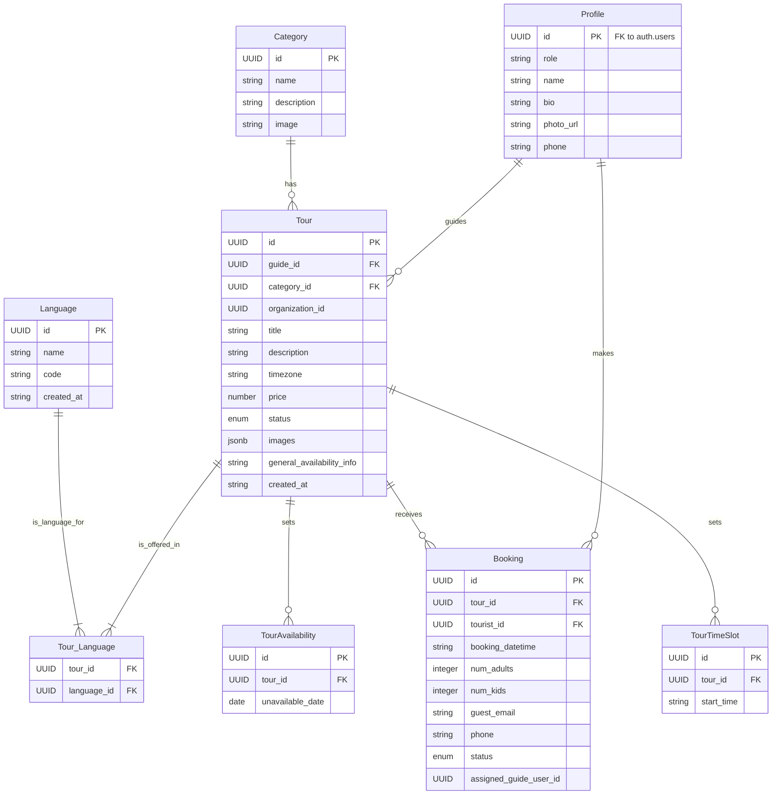

# Data Models

This section defines the core data entities for the Unique Tours Platform. The TypeScript interfaces provided will be shared between the frontend and backend to ensure end-to-end type safety.

### Entity Relationship Diagram



### Profile (User)

**Purpose:** Represents a user of the platform. This table is linked one-to-one with the main `auth.users` table provided by Supabase and extends it with role-specific information.

**Key Attributes:**

  * `id`: `UUID` - Foreign key to `auth.users.id`.
  * `role`: `enum ('tourist', 'guide', 'admin')` - The user's role on the platform.
  * `name`: `text` - The user's full name or display name.
  * `bio`: `text` - A short biography, primarily for Tour Guides.
  * `phone`: `text` - The user's phone number.
  * `photo_url`: `text` - URL to the user's profile picture.

**TypeScript Interface:**

```typescript
interface Profile {
  id: string; // UUID
  role: 'tourist' | 'guide' | 'admin';
  name: string;
  bio?: string;
  phone?: string;
  photo_url?: string;
  created_at: string; // ISO 8601
  updated_at: string;
}
```

### Tour

**Purpose:** Represents a tour listing created by a Tour Guide. This is the central entity of the platform.

**Key Attributes:**

  * `id`: `UUID` - Primary key.
  * `guide_id`: `UUID` - Foreign key to `profiles.id`.
  * `category_id`: `UUID` - Foreign key to `categories.id`.
  * `title`: `text` - The main title of the tour.
  * `description`: `text` - A detailed description of the tour.
  * `timezone`: `text` - A detailed timezone of the tour.
  * `story_html`: `text` - The rich-text "Guide's Story" content.
  * `price`: `number` - The price per participant.
  * `duration`: `text` - The approximate duration of the tour (e.g., "3 hours").
  * `location`: `text` - The starting location or general area.
  * `capacity`: `integer` - The maximum number of participants.
  * `status`: `enum ('draft', 'published')` - The visibility status of the tour.
  * `images`: `jsonb` - An array of URLs for the tour's images.
  * `general_availability_info`: `text` - A text description of when the tour generally runs.
  * `organization_id`: `UUID` (nullable) - Reserved for future "Organization" functionality.

**TypeScript Interface:**

```typescript
interface Tour {
  id: string; // UUID
  guide_id: string; // UUID
  category_id: string; // UUID
  organization_id?: string | null;
  title: string;
  description: string;
  timezone: string;
  story_html: string;
  price: number;
  duration: string;
  location: string;
  capacity: number;
  status: 'draft' | 'published' | 'archived';
  images: TourImage[];
  general_availability_info: string;
  created_at: string; // ISO 8601
  updated_at: string;
}

type TourLanguage {
  name: string;
  code: string;
}

// Define a specific type for a single image object.
// This makes it easy to add more properties like 'caption' later.
type TourImage = {
  url: string;
  caption?: string; // Optional caption for future use
};
``` 
### Category

**Purpose:** To classify tours, allowing tourists to browse and filter by language. The initial list is fixed by developers.

**Key Attributes:**

  * `id`: `UUID` - Primary key.
  * `name`: `text` - The unique name of the category (e.g., "Culinary", "Adventure").
  * `description`: `string` - Short description.
  * `image`: `string` - The image url of category.

**TypeScript Interface:**

```typescript
interface Category {
  id: string; // UUID
  name: string;
  description: string // Short description
  image: string; // The hero image of category
}
```

### Language

**Purpose:** To classify tours, allowing tourists to browse and filter by interest language. The initial list is fixed by developers.

**Key Attributes:**

  * `id`: `UUID` - Primary key.
  * `name`: `text` - e.g., "English"
  * `code`: `string` - e.g, "en".

**TypeScript Interface:**

```typescript
interface Category {
  id: string; // UUID
  name: string;
  description: string // Short description
  image: string; // The hero image of category
}
```

### Booking

**Purpose:** Represents a single booking of a tour by a tourist, which can be confirmed or rejected by the guide.

**Key Attributes:**

  * `id`: `UUID` - Primary key.
  * `tour_id`: `UUID` - Foreign key to `tours.id`.
  * `tourist_id`: `UUID` (nullable) - Foreign key to `profiles.id` for registered users.
  * `guest_name`: `text` (nullable) - Name provided by a guest tourist.
  * `guest_email`: `text` (nullable) - Email provided by a guest tourist.
  * `phone`: `text` (nullable) - Phone number for the booking.
  * `num_adults`: `integer`
  * `num_kids`: `integer`
  * `booking_datetime`: `date` - The specific date and time of the booking the tourist has booked.
  * `status`: `enum ('pending', 'confirmed', 'rejected', 'cancelled')` - The current status of the booking.
  * `assigned_guide_user_id`: `UUID` (nullable) - Reserved for future "Organization" functionality.

**TypeScript Interface:**

```typescript
interface Booking {
  id: string; // UUID
  tour_id: string; // UUID
  tourist_id?: string; // UUID
  guest_name?: string;
  guest_email?: string;
  phone?: string;
  num_adults: number;
  num_kids: number;
  booking_datetime: string; // ISO 8601 format
  status: 'pending' | 'confirmed' | 'rejected' | 'cancelled';
  assigned_guide_user_id?: string; // UUID
  created_at: string; // ISO 8601
}
```

### Tour Availability

**Purpose:** Tracks dates when a specific tour is *not* available, as set by the Tour Guide.

**Key Attributes:**

  * `id`: `UUID` - Primary key.
  * `tour_id`: `UUID` - Foreign key to `tours.id`.
  * `unavailable_date`: `date` - A specific date that is blocked off.

**TypeScript Interface:**

```typescript
interface TourAvailability {
  id: string; // UUID
  tour_id: string; // UUID
  unavailable_date: string; // YYYY-MM-DD
}
```

### TourTimeSlot

**Purpose:** To store the predefined appointment times available for a specific tour.

**Key Attributes:**
  * `id`: `UUID`
  * `tour_id`: `UUID` - Foreign key to the `tours` table.
  * `start_time`: `TIME` - The time of the slot (e.g., '09:00:00').

**TypeScript Interface:**

  ```typescript
  interface TourTimeSlot {
    id: string; // UUID
    tour_id: string; // UUID
    start_time: string; // HH:MM:SS format
  }
  ```
**Relationships:** Many-to-one with `Tour`.
