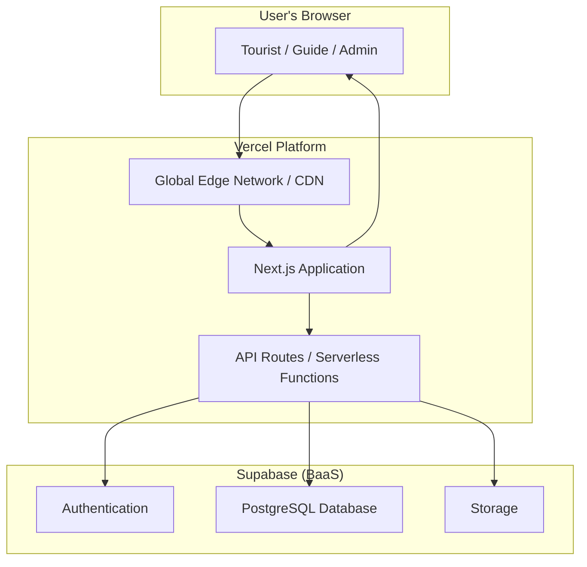

# High Level Architecture

### Technical Summary

This architecture outlines a fullstack solution for the Unique Tours Platform, centered around a monolithic Next.js application deployed on Vercel. The frontend will be built with React and Next.js, while the backend logic will be handled by a combination of Next.js API routes (acting as serverless functions) and Supabase's Backend-as-a-Service (BaaS) capabilities. Supabase will provide the core PostgreSQL database, user authentication, and file storage. This serverless, integrated approach is designed to meet the project's goals for rapid development, low operational overhead, cost-effectiveness, and future scalability.

### Platform and Infrastructure Choice

Based on the requirements in the PRD, the chosen platform is a combination of Vercel for hosting and Supabase for the backend services.

**Platform:** Vercel + Supabase
**Key Services:**

  * **Vercel:** Hosting, Serverless Functions (for API routes), CI/CD, Global Edge Network.
  * **Supabase:** PostgreSQL Database, Authentication, and File Storage.
    **Deployment Host and Regions:**
  * **Vercel:** Global Edge Network (no specific region selection required).
  * **Supabase:** Recommend **Asia Pacific (Singapore)** for lowest latency to users in Vietnam.

This combination is highly recommended as it is purpose-built for the Next.js framework, providing exceptional performance, seamless deployment workflows, and a generous free tier that aligns with the MVP's budget constraints.

### Repository Structure

The project will use a **Monorepo** structure, as specified in the PRD.

  * **Structure:** Monorepo
  * **Monorepo Tool:** npm/pnpm/yarn workspaces (TBD, recommend starting with npm workspaces for simplicity).
  * **Rationale:** This approach allows for a single source of truth, simplified dependency management, and the ability to share code (e.g., TypeScript types) between the frontend and backend API routes, which is ideal for a fullstack Next.js application.

### High Level Architecture Diagram

This diagram illustrates the primary components and data flow of the system.

### Architectural and Design Patterns

The following patterns will guide the development of the platform:

  * **Serverless Architecture:** The entire application leverages serverless principles. The Next.js application is deployed as serverless functions on Vercel, and Supabase provides serverless backend services.
      * *Rationale:* This pattern directly supports requirements for scalability (NFR3), maintainability (NFR11), and cost-effectiveness (NFR13) by eliminating the need to manage server infrastructure.
  * **Component-Based UI:** The frontend will be built as a collection of reusable React components.
      * *Rationale:* Inherent to the Next.js/React framework, this promotes code reuse and simplifies maintenance, aligning with NFR11.
  * **Backend as a Service (BaaS):** Supabase will be used for core backend functionality.
      * *Rationale:* This significantly accelerates development time (NFR12) and provides robust, pre-built solutions for authentication (NFR5, NFR6) and data persistence.
  * **API Routes as BFF (Backend-for-Frontend):** Next.js API routes will serve as the intermediary between the client-side application and Supabase.
      * *Rationale:* This pattern allows for secure handling of credentials, aggregation of data from multiple sources (if needed in the future), and tailoring of data payloads specifically for the frontend's needs, simplifying client-side logic. 