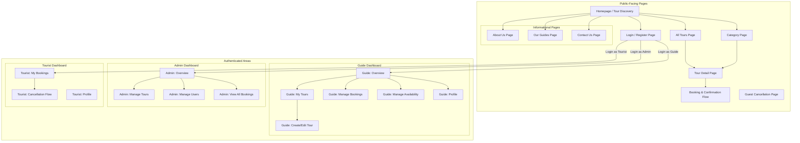
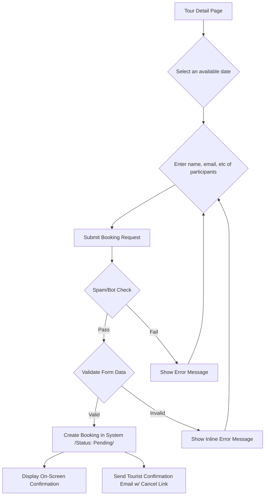
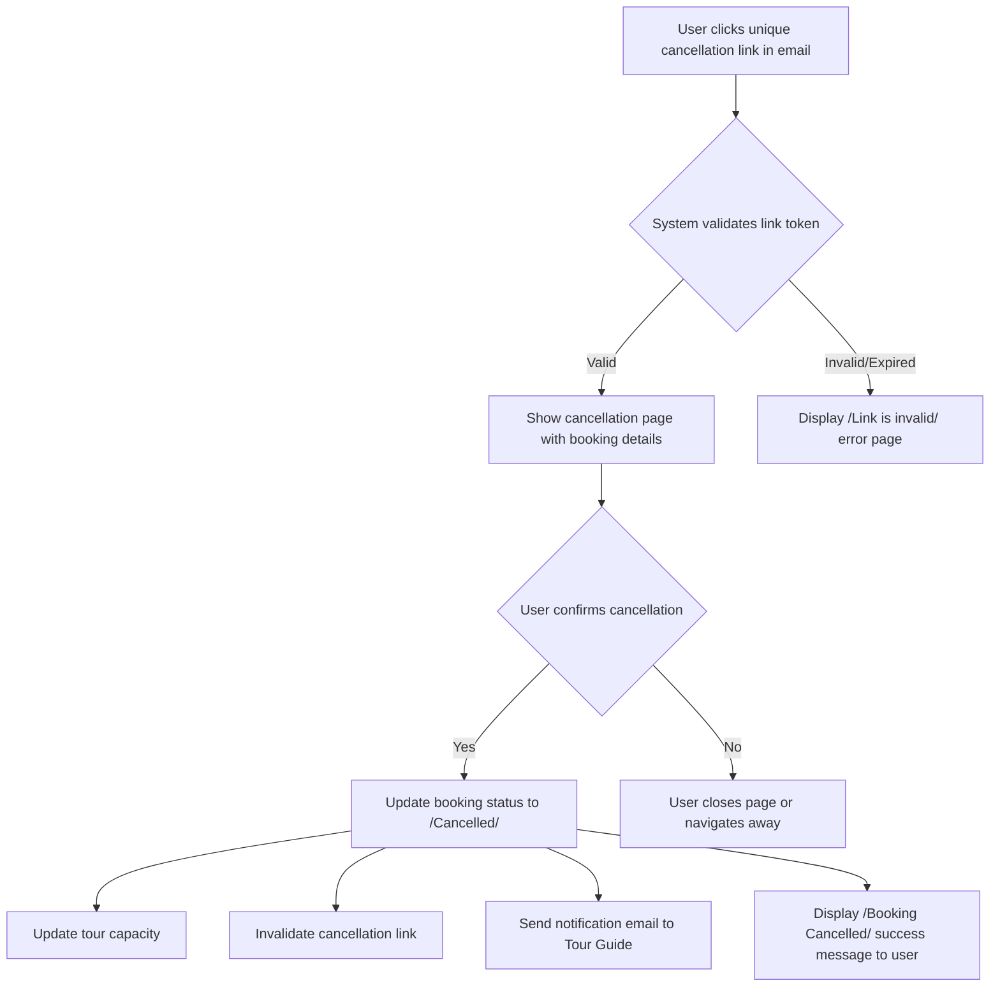
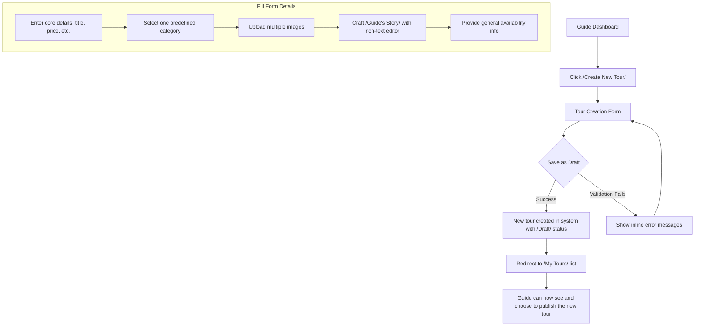
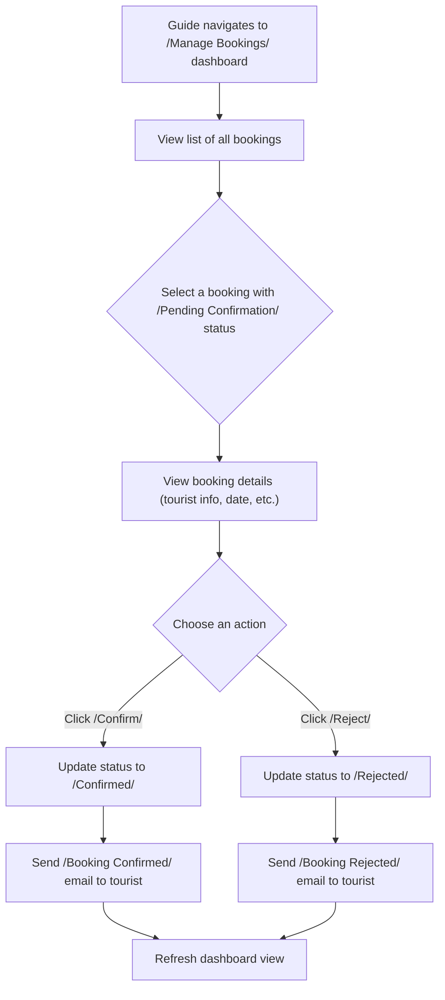
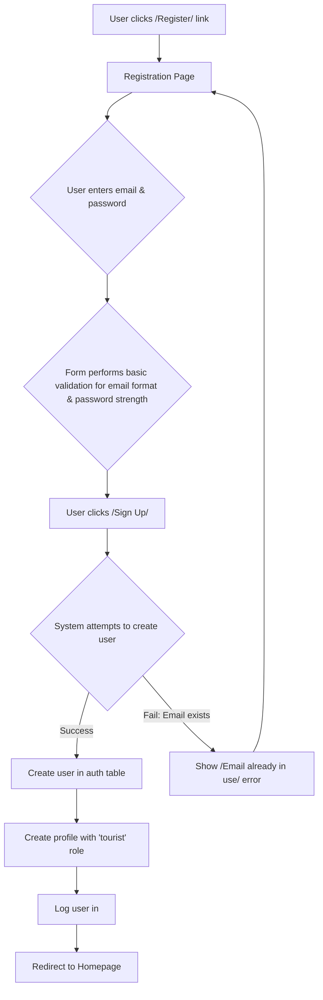

# Unique Tours Platform UI/UX Specification

## Introduction

This document defines the user experience goals, information architecture, user flows, and visual design specifications for the Unique Tours Platform. It serves as the foundation for visual design and frontend development, ensuring a cohesive and user-centered experience.

### Overall UX Goals & Principles

#### Target User Personas

  * **The Adventurous Traveler (Tourist):** A traveler seeking to discover and book unique, unforgettable, and off-the-beaten-path adventures through a trustworthy platform. [cite: 3, 9]
  * **The Passionate Storyteller (Tour Guide):** A local expert who needs a platform to effectively share their passions, manage their niche tour offerings, and connect with travelers. [cite: 2, 8]
  * **The Platform Guardian (Administrator):** A system manager who requires efficient tools to oversee all users and tours to ensure the platform's integrity and quality. [cite: 27, 28, 31]

#### Usability Goals

  * **Intuitive & Straightforward:** The user journeys for all roles must be intuitive, straightforward, and easy to navigate. [cite: 40, 46]
  * **Seamless Discovery & Booking:** Tourists must be able to seamlessly browse listings, use simple search and filtering, and follow an intuitive process for booking and cancellation. [cite: 47]
  * **Efficient Management:** Guides need an easy-to-use interface to create and manage their tours and bookings. Admins need efficient tools for user and tour management. [cite: 48, 50]

#### Design Principles

1.  **Trustworthiness First:** The design must project trustworthiness, establishing the platform as a reliable source for authentic local tours. [cite: 44]
2.  **Minimalist & Modern:** The visual style will be minimalist, modern, clean, and visually appealing, inspired by the aesthetic of atasteofhanoi.com. [cite: 45, 56]
3.  **Content-Centric:** The design will emphasize the uniqueness of the tours and the rich storytelling from the guides. [cite: 8, 45]
4.  **Mobile-First Responsive:** The platform will be designed first for mobile browsers to ensure it functions effectively on all devices. [cite: 58]

### Change Log

| Date | Version | Description | Author |
| :--- | :------ | :---------- | :----- |
| 2025-06-25 | 1.0 | Initial draft of the complete UI/UX Specification. | Sally (UX Expert) |

## Information Architecture (IA)

### Site Map / Screen Inventory

This diagram shows the primary pages and sections of the platform and how they relate to one another across the three main user roles.

### Navigation Structure

#### **Primary Navigation (Main Menu)**

This is the main site-wide menu, which will adapt based on whether the user is logged in. [cite: 108]

  * **For Unauthenticated Visitors:**
      * **Tours**
      * **Categories**
      * **Our Guides**
      * **About Us**
      * **Contact Us**
      * **Login / Register**
  * **For Authenticated Users (e.g., a logged-in Tourist):**
      * The same links as above, but "Login / Register" is replaced with:
      * **My Dashboard**
      * **Logout** [cite: 104]

#### **Secondary Navigation (Contextual Menus)**

These menus would appear within specific sections, like a sidebar in the user dashboards.

  * **In the Guide Dashboard:** [cite: 52]
      * Overview
      * My Tours
      * Manage Bookings
      * Manage Availability
      * Manage Profile
  * **In the Admin Dashboard:** [cite: 53]
      * Overview (Key Statistics)
      * Manage Tours
      * Manage Users
      * View All Bookings

#### **Breadcrumb Strategy**

We will implement breadcrumbs on all nested pages to help users understand their location within the site's hierarchy and easily navigate back to previous levels.

  * **Example:** `Home > Tours > Culinary > A Taste of Old Hanoi`

## User Flows

### Tourist Booking a Tour (Guest Flow)

**User Goal:** To find a desired tour, select an available date, and successfully submit a booking request without creating an account. [cite: 178]

**Entry Points:** The user is on a specific Tour Detail Page. [cite: 174]

**Success Criteria:**

  * The user successfully submits the booking form.
  * A booking record is created in the system with a "Pending Confirmation" status. [cite: 180]
  * The user sees an immediate on-screen confirmation message. [cite: 186]
  * The user receives a confirmation email stating the booking is pending and containing a unique cancellation link. [cite: 187, 188]

#### Flow Diagram

**Edge Cases & Error Handling:**

  * **Invalid form data:** Standard inline validation for email format should be present. [cite: 100]
  * **Spam protection:** The booking form for guest tourists will have a simple spam protection measure, like a CAPTCHA or honeypot field. [cite: 179]

### Guest Tourist Cancels Booking via Email Link

**User Goal:** To cancel a pending or confirmed tour booking using the unique link from their confirmation email, without needing an account. [cite: 204]

**Entry Points:** The user clicks the unique, secure cancellation link provided in their booking confirmation email. [cite: 204]

**Success Criteria:**

  * The booking status is changed to "Cancelled by Guest" in the system. [cite: 206]
  * The tour's available capacity is correctly updated. [cite: 207]
  * The unique cancellation link is invalidated after use. [cite: 207]
  * The tour guide receives an email notification about the cancellation. [cite: 211]

#### Flow Diagram

### Tour Guide Creates a New Tour Listing

**User Goal:** As an authenticated Tour Guide, to create and save a new tour listing by providing all the necessary details, so that it can be published for tourists to discover. [cite: 22, 116]

**Entry Points:** A "Create Tour" button or link within the authenticated Tour Guide's dashboard. [cite: 123]

**Success Criteria:**

  * A new tour record is created in the database, associated with the guide, and saved with a "Draft" or "Unpublished" status. [cite: 139]
  * The guide can see their newly created draft in their list of tours. [cite: 137]
  * From their list of tours, the guide can choose to publish the listing, making it visible to the public. [cite: 140]

#### Flow Diagram

### Tour Guide Manages an Incoming Booking Request

**User Goal:** As an authenticated Tour Guide, to view incoming booking requests for my tours and be able to confirm or reject them to finalize the booking and manage my schedule. [cite: 190]

**Entry Points:** The "Manage Bookings" dashboard, accessible from the Tour Guide's main dashboard. [cite: 190]

**Success Criteria:**

  * **On Confirm:** The booking status changes to "Confirmed", and an email is automatically sent to the tourist notifying them. [cite: 25, 210]
  * **On Reject:** The booking status changes to "Rejected", and an email is automatically sent to the tourist notifying them. [cite: 25, 210]
  * The updated booking status is visible in the guide's booking list. [cite: 191]

#### Flow Diagram

### New User Registration

**User Goal:** To create a new account using an email and password to access platform features as a Tourist or to eventually become a Tour Guide. [cite: 95]

**Entry Points:** The "Login / Register" link in the site's primary navigation. [cite: 96]

**Success Criteria:**

  * A new user is created in the backend authentication system. [cite: 97]
  * A corresponding entry is created in the `profiles` table with the default role of 'tourist'. [cite: 98]
  * The user is automatically logged in and redirected to the homepage. [cite: 99]

#### Flow Diagram

## Wireframes & Mockups

**Primary Design Files:** TBD

## Branding & Style Guide

### Visual Identity

**Brand Guidelines:** The visual identity will be clean, minimalist, and modern, inspired by the reference site `atasteofhanoi.com`. [cite: 56] The design should feel trustworthy and emphasize the high-quality photography of the tours. [cite: 44]

### Color Palette

| Color Type | Hex Code (Approximate) | Usage |
| :--- | :--- | :--- |
| **Primary/Action** | `#FF9900` | Main buttons, calls-to-action, important links. |
| **Dark Background** | `#212121` | Primary background color for most sections. |
| **Light Background** | `#FFFFFF` | Contrasting background for specific content blocks. |
| **Primary Text** | `#FFFFFF` | Default text color on dark backgrounds. |
| **Secondary Text** | `#333333` | Default text color on light backgrounds. |

### Typography

**Font Families:**

  * **Primary (Headings):** **Lora** or a similar elegant serif font. This will be used for main page titles to convey a sense of quality and trustworthiness.
  * **Secondary (Body/UI):** **Montserrat** or a similar clean sans-serif font. This will be used for all paragraph text, subheadings, buttons, and other interface elements to ensure clarity and readability.

## Component Library / Design System

**Design System Approach:** We will define a simple set of core components based on the visual style of the reference site. This will ensure a consistent look and feel across the entire platform.

### Core Components

#### **Button**

**Purpose:** The primary element for user actions, such as booking a tour or submitting a form.
**States:**

  * **Default:** A solid, vibrant orange background with white text.
  * **Hover:** The button should subtly change on hover to indicate it's clickable.
  * **Disabled:** A grayed-out version of the button that is not interactive.

#### **Tour Card**

**Purpose:** To display a concise summary of a tour on the homepage and category listing pages. [cite: 147]
**Visual Style:**

  * **Container:** A clean, white rectangular card with a subtle drop shadow.
  * **Image:** A high-quality, full-width photo of the tour experience at the top.
  * **Content Area:** A padded section below the image containing a title, description, and the primary orange action button.

## Accessibility Requirements

### Compliance Target

While the MVP will not target a formal compliance standard, it will adhere to best practices for basic usability. [cite: 54]

### Key Requirements

  * **Semantic HTML:** Use correct HTML tags for their intended purpose.
  * **Image Alt Text:** All meaningful images must have descriptive alternative text.
  * **Form Labels:** Every input field in a form must have a clearly associated label.
  * **Basic Focus Indicators:** Ensure the browser's default visual outline on clickable elements is not disabled.

## Responsiveness Strategy

This strategy is guided by the "mobile-first" principle, meaning we will design for the smallest screen size first and then adapt the layout for larger screens. [cite: 58]

### Breakpoints

| Breakpoint | Min Width | Target Devices |
| :--- | :--- | :--- |
| **Mobile** | 320px | Most smartphones |
| **Tablet** | 768px | iPads, other tablets |
| **Desktop** | 1024px | Laptops and desktop monitors |

## Animation & Micro-interactions

### Motion Principles

Animations should be used sparingly to enhance usability and provide clear feedback to the user.

### Key Animations

  * **Hover Effects:** Subtle transitions on buttons and cards.
  * **Page Transitions:** A simple and fast fade-in/fade-out effect when navigating between pages.
  * **Form Field Focus:** A subtle border color change on active form fields.

## Performance Considerations

### Performance Goals

  * **Page Load:** Core pages should aim to be interactive in under 3 seconds on a standard mobile connection. [cite: 32]
  * **Interaction Response:** User actions, like clicks, should provide feedback in under 100ms.

### Design Strategies

  * **Image Optimization:** All photography must be compressed and optimized for the web.
  * **Lazy Loading:** Images that are not visible on the screen initially should be loaded as the user scrolls.

## Next Steps

### Immediate Actions

1.  **Final Review:** Share this completed UI/UX Specification with all project stakeholders for final review and approval.
2.  **Begin Frontend Development:** Use this document as the primary guide for implementing the user interface, styling, and interaction patterns.
3.  **Handoff to Architecture:** This document is ready to be handed off to a technical architect to create the detailed frontend architecture and plan the development sprints. [cite: 233]

### Design Handoff Checklist

  - [x] All user flows documented
  - [x] Component inventory complete
  - [x] Accessibility requirements defined
  - [x] Responsive strategy clear
  - [x] Brand guidelines incorporated
  - [x] Performance goals established